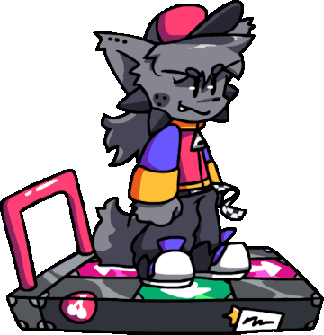
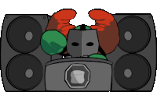

# Site de FNF

<h4>
  Nesse repositório irei deixar um site sobre o jogo Friday night funkin, onde deixo dois dos meus mods favoritos, e o jogo original.
     
  Também vou falar sobre o que se trata a história do jogo e a história dos mods.
</h3>

##

<h4>Os mods são:</h4>

<h5>Jogo original:</h5>

<h5>Vs Arcade Showndown:</h5>

<h5>Vs Tricky:</h5>

##

<h4>Essas foram as tecnologias utilizadas:</h4>

  

##

<h4>Observações: </h4>

<h5>Eu escrevi esse código pelo celular, talvez o codigo esteja um pouco estranho pois escrevi de uma forma que fique melhor na tela do meu celular.  Mas estou aceitando dicas de como deixar meu codigo melhor.  </h5>

<h3>Obrigado por ver até aqui :D</h3>
